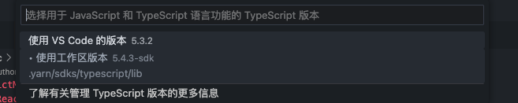

# 项目架构文档

## 项目创建步骤

<!-- ### yarn 版本更新

yarn 版本为4

```bash 
#!/bin/bash
yarn --version 
1.22.19
yarn set version stable
yarn --version                                                          
4.1.1
```
-->

### 基于yarn4 React tailwind 构建项目

```bash
npx create-nx-workspace@latest --pm=yarn
✔ Where would you like to create your workspace? · Biomind-web
✔ Which stack do you want to use? · react
✔ What framework would you like to use? · none
✔ Integrated monorepo, or standalone project? · integrated
✔ Application name · ultrasound
✔ Which bundler would you like to use? · vite
✔ Test runner to use for end to end (E2E) tests · cypress
✔ Default stylesheet format · tailwind
✔ Set up CI with caching, distribution and test deflaking · skip
✔ Would you like remote caching to make your build faster? · skip
```
<!-- 
### 切换yarn到PnP（即插即用）

```bash
yarn config set nodeLinker pnp

yarn install

yarn nx serve ultrasound
```

### 添加Yarn Pnp SDK

> 此时编辑器Typescript报错，因为 Yarn Pnp 通过生成Node.js loader来工作，vscode不支持

生成基础 SDK 和编辑器设置：

```bash
yarn dlx @yarnpkg/sdks vscode vim ...
```

```bash
生成基础 SDK，但没有编辑器设置：


```bash
yarn dlx @yarnpkg/sdks base
```

更新所有已安装的 SDK 和编辑器设置：

```bash
yarn dlx @yarnpkg/sdks
```
### 手动激活自定义的Typescript设置

 -->